# DriftQ-Core - Architecture

> This document explains the architecture of DriftQ-Core in a visual, diagram-first way.
> It is meant to help readers build a mental model quickly, even on a first read.

---

## 0. TL;DR — One Sentence

> **DriftQ-Core is a single-process durable broker + a replayable workflow runtime, with v3 layers that make AI-style orchestration safer, more inspectable, and more controllable.**

---

## 1. What Is DriftQ-Core?

One Go binary — **`driftqd`** — ships three functional layers and a shared platform.

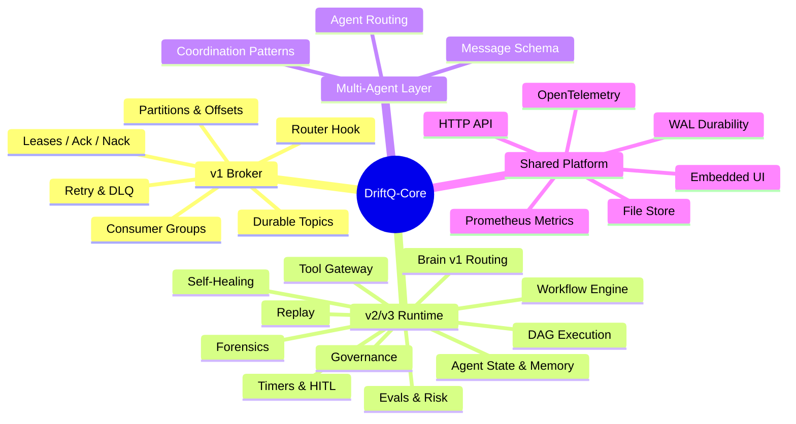

---

## 2. Top-Level System Map

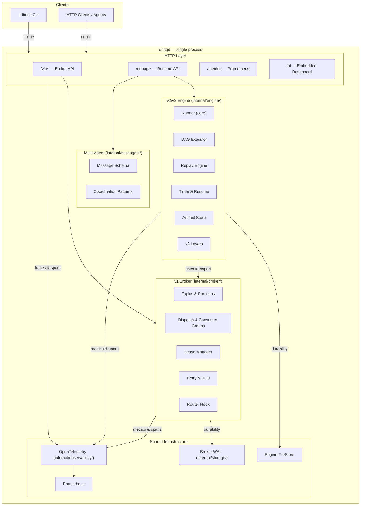

---

## 3. Server Startup Sequence

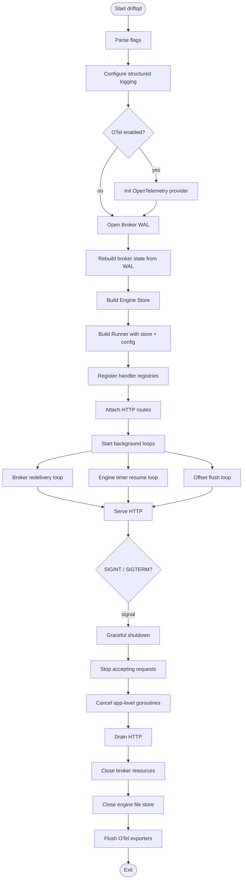

> **Key insight:** durable state is written **incrementally** during normal operation — restart recovery comes from the WAL and FileStore, not a final checkpoint.

---

## 4. The Broker Architecture

### 4.1 Broker Internal Structure

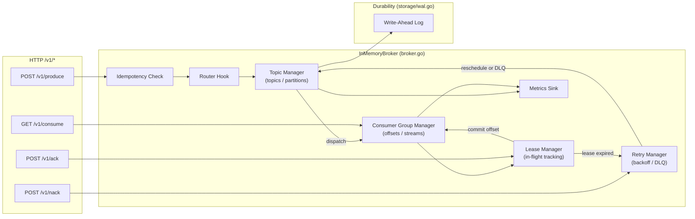

### 4.2 Broker Message Produce Flow

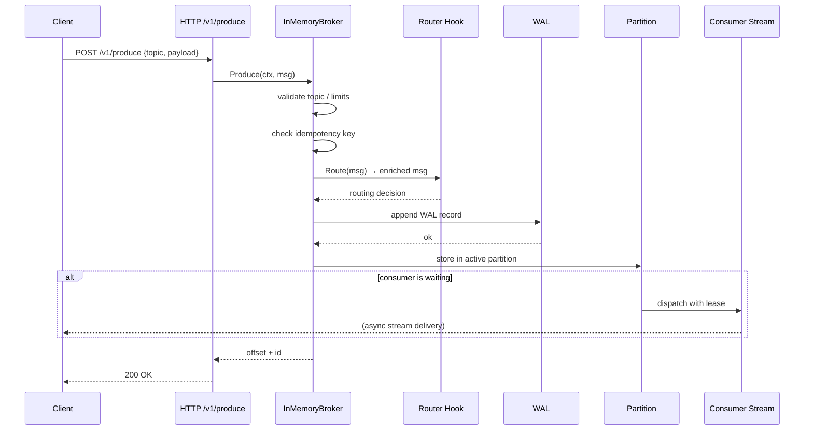

### 4.3 Broker Consume / Ack Flow

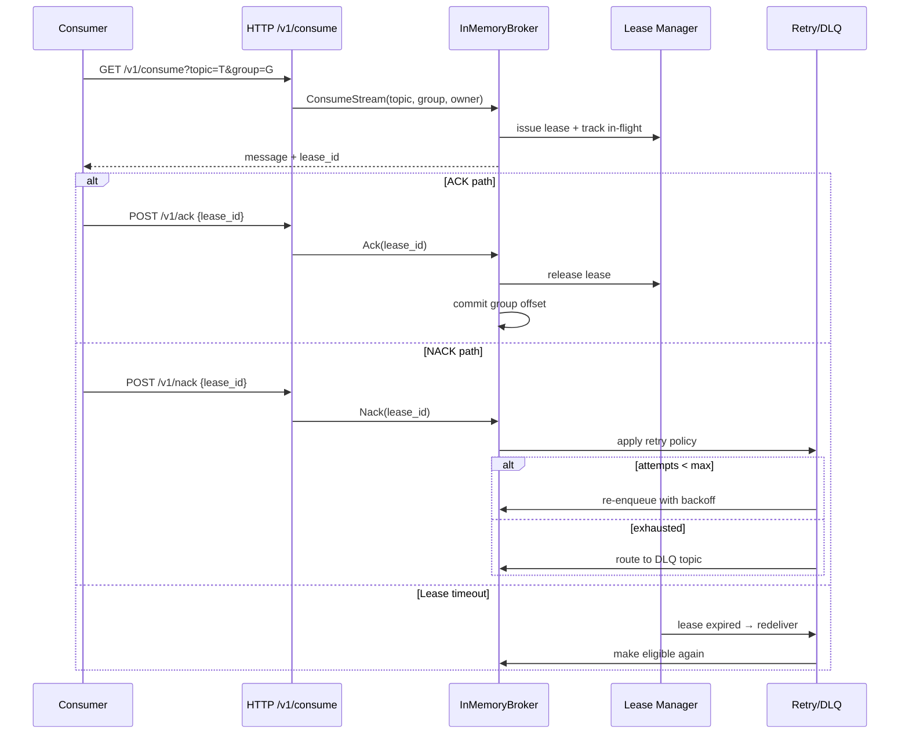

### 4.4 Broker Durability Mental Model

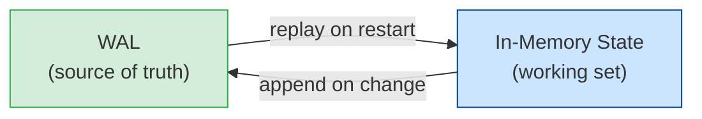

---

## 5. The Workflow Runtime Architecture

### 5.1 Runner Internals

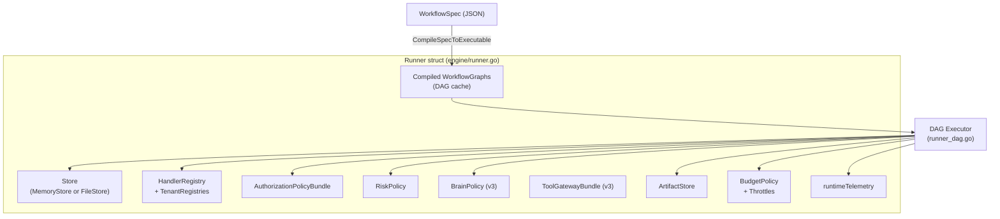

### 5.2 Workflow Execution Flow (Happy Path)

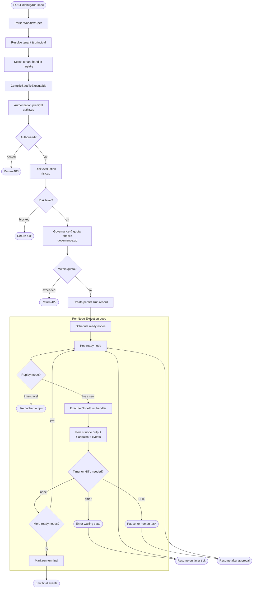

### 5.3 DAG Execution (Parallel Nodes)

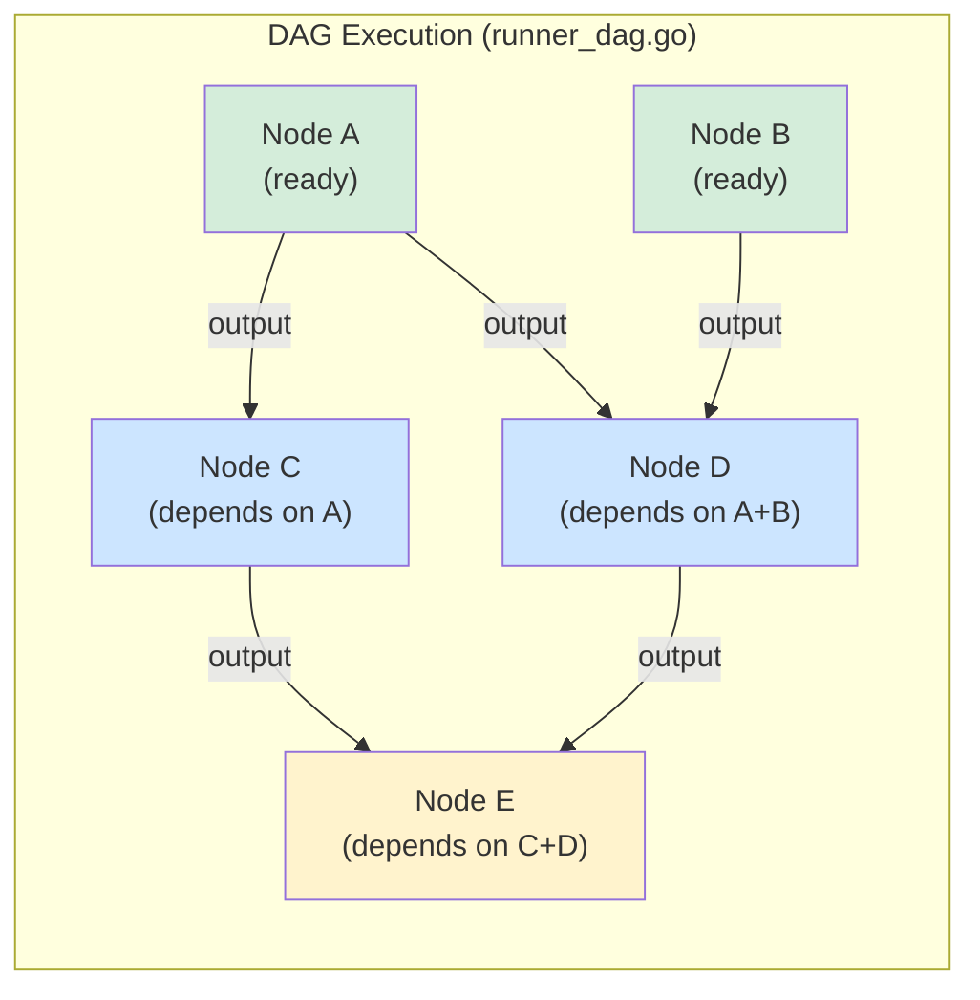

> Nodes A and B run in parallel. Node D becomes ready only when both A and B finish (join barrier). Fan-out up to `maxParallel` goroutines.

---

## 6. Replay Architecture

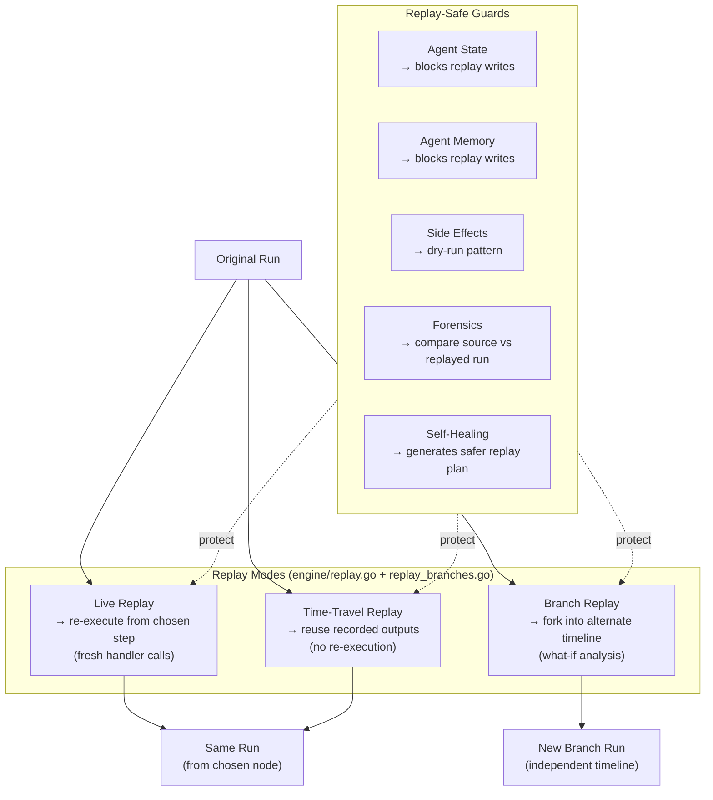

### 6.1 Branch Replay Timelines

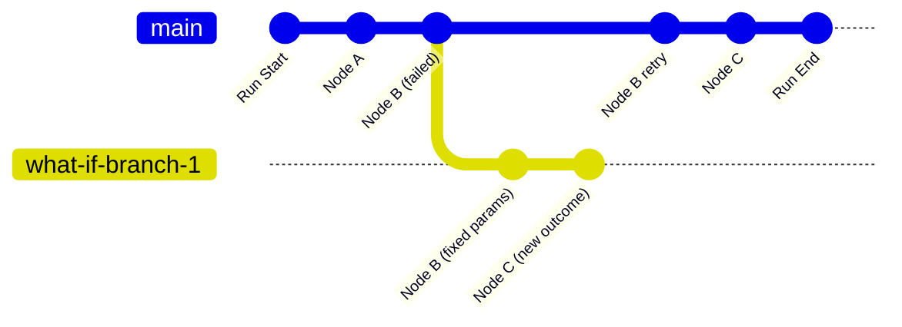

---

## 7. v3 Feature Layers

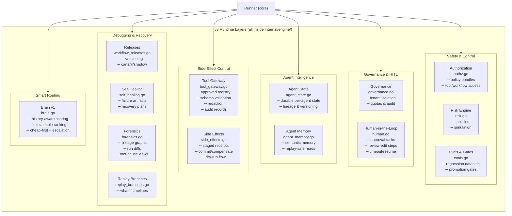

---

## 8. Multi-Agent Layer

```mermaid
graph LR
    subgraph MA["internal/multiagent/"]
        SCHEMA["Agent Message Schema"]
        VALID["Routing Validation\n(agent/team/capability/role)"]
        COORD["Coordination Patterns"]
    end

    subgraph PATTERNS["Coordination Patterns"]
        PW["Planner / Worker"]
        REV["Reviewer Flow"]
        RR["Request / Reply"]
        HO["Handoff"]
        ESC["Escalation"]
        BC["Broadcast"]
    end

    subgraph TRANSPORT["Transport"]
        BROKER["v1 Broker Topics"]
    end

    SCHEMA --> VALID --> COORD --> PATTERNS
    PATTERNS --> BROKER
    BROKER --> ENGINE["Engine Runner\n(processes messages as workflow inputs)"]
```

---

## 9. Persistence Architecture

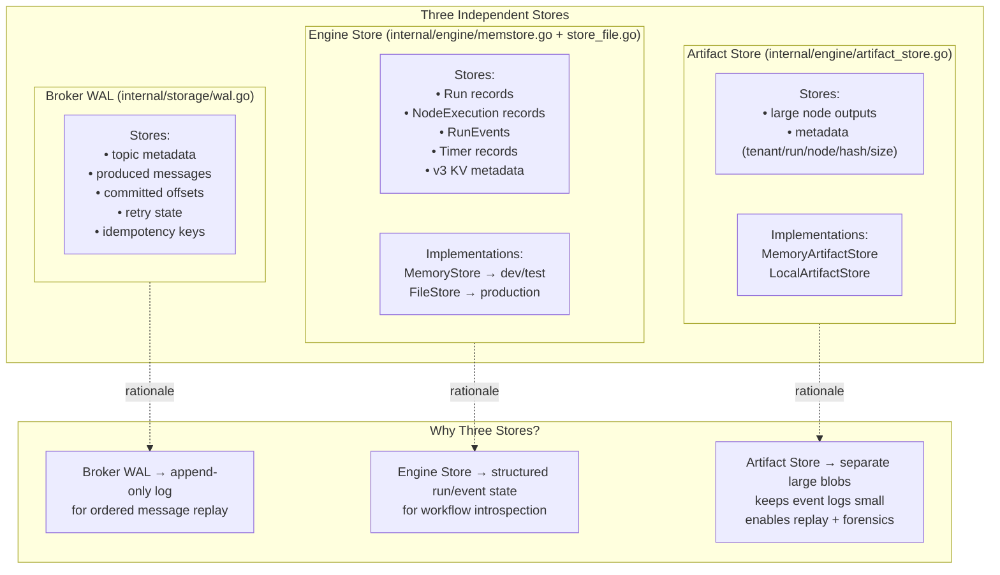

---

## 10. HTTP API Surface

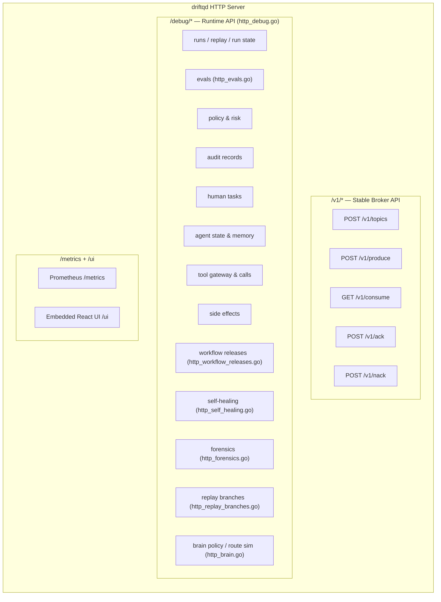

---

## 11. Observability Architecture

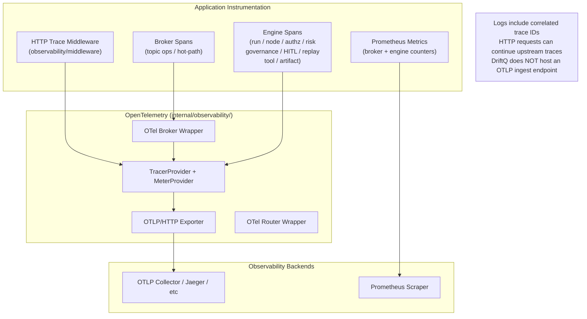

---

## 12. Concurrency Model

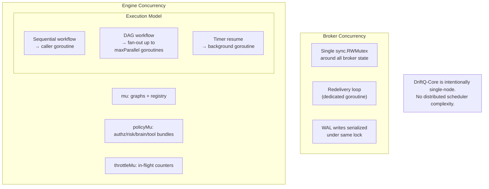

---

## 13. Package Map (Annotated)

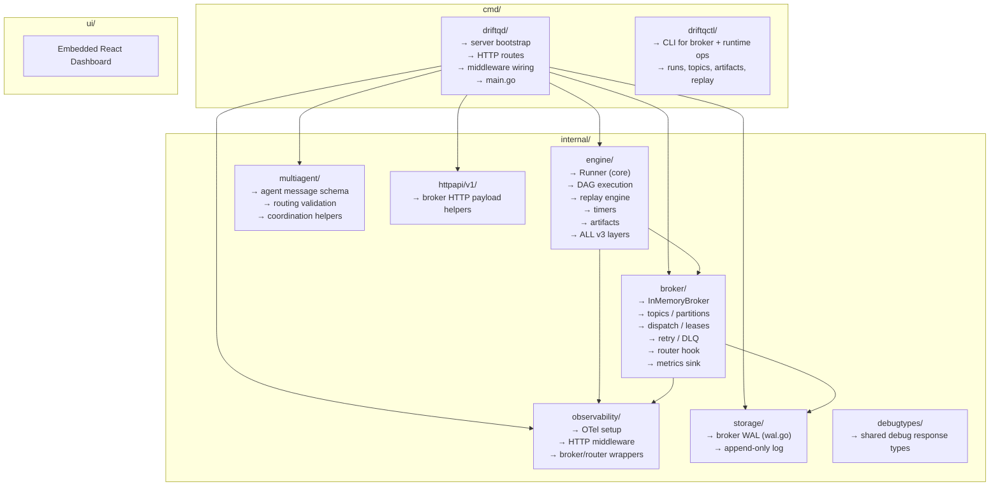

---

## 14. Extension Points

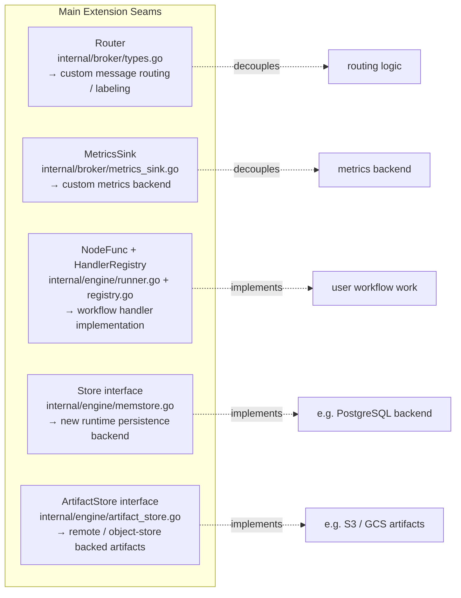

---

## 15. Brain v1 Adaptive Routing

```mermaid
flowchart TD
    START([Incoming Node Execution]) --> SAFE[Apply safety/policy filters\nauthz.go + risk.go]
    SAFE --> HIST[Load run history\nbrain.go BrainPolicy]
    HIST --> SCORE[Score candidate routes\n─ cost ceilings\n─ provider/model policy\n─ past success rates\n─ latency / failure history]
    SCORE --> RANK[Explainable route ranking]
    RANK --> CHEAP{Cheap-first\nroute sufficient?}
    CHEAP -->|yes| EXEC_CHEAP([Execute on cheap route])
    CHEAP -->|no| ESC{Uncertainty /\nfailure / high risk?}
    ESC -->|yes| ESCALATE([Escalate to stronger model])
    ESC -->|no| EXEC_BEST([Execute on best-scored route])
```

> Brain v1 is **heuristic and explainable** — not a machine-learning model.

---

## 16. Design Philosophy — Tradeoffs Visualized

```mermaid
quadrantChart
    title DriftQ-Core Design Tradeoffs
    x-axis Simple --> Complex
    y-axis Local --> Distributed
    quadrant-1 Future roadmap
    quadrant-2 Distributed simplicity
    quadrant-3 Current DriftQ-Core
    quadrant-4 Local complexity
    Single-node operation: [0.1, 0.15]
    Append-only WAL durability: [0.2, 0.1]
    Explicit debug routes: [0.3, 0.1]
    Runtime layering (vs microservices): [0.25, 0.2]
    Distributed cloud control plane: [0.75, 0.85]
```

| Decision | Chosen | Alternative | Why |
|---|---|---|---|
| Single-node | ✅ | Distributed | Simpler ops & reasoning |
| Append-only WAL | ✅ | Complex query DB | Easier replay & debugging |
| Debug routes | ✅ | Abstraction purity | Debuggability over purity |
| Runtime layering | ✅ | Separate microservices | One engine, less network |

---

## 17. Suggested Reading Order

```mermaid
flowchart LR
    README["1. README.md"] --> MAIN["2. cmd/driftqd/main.go"]
    MAIN --> BROKER["3. internal/broker/\nbroker.go, types.go"]
    BROKER --> ENGINE["4. internal/engine/\nrunner.go, types.go"]
    ENGINE --> MA["5. internal/multiagent/\nregistry.go"]
    MA --> OBS["6. internal/observability/"]
    OBS --> CTL["7. cmd/driftqctl/"]

    style README fill:#d4edda
    style CTL fill:#d4edda
```

**If you only care about one area:**

| Goal | Start here |
|---|---|
| Broker only | `internal/broker/` → `broker.go`, `types.go` |
| Workflow runtime | `internal/engine/` → `runner.go`, `runner_dag.go`, `spec.go` |
| Agent routing / messages | `internal/multiagent/` → `registry.go` |
| OTel / traces / metrics | `internal/observability/` |
| v3 safety layers | `internal/engine/` → `authz.go`, `risk.go`, `governance.go`, `human.go` |
| Replay / forensics | `internal/engine/` → `replay.go`, `replay_branches.go`, `forensics.go` |
| Smart routing | `internal/engine/brain.go` |

---

## 18. Final Mental Model

```mermaid
graph TB
    BROKER["Broker\n= durable transport\n(messages flow here)"]
    ENGINE["Engine\n= durable execution\n(workflows run here)"]
    MULTIAGENT["Multi-Agent\n= structured communication\n(on top of broker)"]
    SAFETY["Guardrails / Governance / HITL\n= safety & control\n(around execution)"]
    INTEL["State / Memory / Releases / Replay / Forensics\n= long-lived runtime intelligence\n(debugging & self-improvement)"]
    OBS_FINAL["Observability\n= visibility across all layers"]

    BROKER -->|transport for| ENGINE
    ENGINE -->|uses| MULTIAGENT
    ENGINE -->|enforced by| SAFETY
    ENGINE -->|augmented by| INTEL
    BROKER & ENGINE & SAFETY & INTEL -->|instrumented by| OBS_FINAL
```
